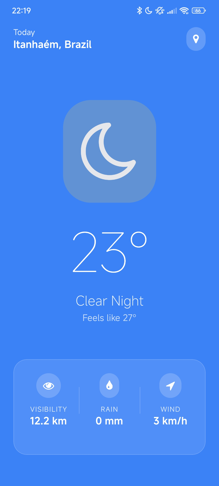

<div align="center">

# 🌤️ Weather App



*A beautiful, modern weather application built with React Native and Expo*

[](https://reactnative.dev/)
[](https://expo.dev/)
[](https://www.typescriptlang.org/)
[](https://open-meteo.com/)

</div>

## 🚀 Getting Started

### Prerequisites
- Node.js (v18+)
- npm or yarn
- Expo CLI
- iOS Simulator / Android Emulator (optional)

### Installation

1. **Clone the repository**
   ```bash
   git clone https://github.com/Renato-Chaves/weather-app.git
   cd weather-app/app
   ```

2. **Install dependencies**
   ```bash
   npm install
   ```

3. **Start the development server**
   ```bash
   npx expo start
   ```

4. **Run on your device**
   Scan QR code with Expo Go app

---

## 📊 API Integration

### OpenMeteo Weather API
- **Real-time Data**: Temperature, humidity, pressure, UV index
- **Location-based**: Automatic timezone detection
- **Global Coverage**: Worldwide weather information
- **Free Tier**: No API key required

```typescript
// Current weather parameters
const weatherParams = [
  "temperature_2m", "apparent_temperature", "rain", 
  "precipitation", "surface_pressure", "wind_speed_10m", 
  "wind_direction_10m", "uv_index", "visibility", "is_day"
];
```

---

## 📱 Screenshots & Features

<div align="center">

### 🏠 **Main Weather Display**
- Large, prominent temperature display
- Dynamic day/night weather icons
- "Feels like" temperature
- Beautiful gradient backgrounds

### 📊 **Weather Details**
- **Visibility**: Real-time visibility distance
- **Wind**: Current wind speed and direction  
- **UV Index**: With risk level indicators
- **Pressure**: Atmospheric pressure readings
- **Sunrise**: Estimated sunrise times

### 🎨 **Design Highlights**
- **Glassmorphism Effects**: Frosted glass UI elements
- **Smooth Animations**: Fluid user interactions
- **Modern Typography**: Clean, readable fonts
- **Responsive Layout**: Works on all screen sizes

</div>

---

## 🔧 Development

### Project Structure
```
weather-app/
├── app/                 # Main app directory
│   ├── app/            # Expo Router pages
│   │   ├── index.tsx   # Main weather screen
│   │   └── _layout.tsx # Root layout
│   ├── assets/         # Images and static files
│   └── package.json    # Dependencies
└── images/             # README images
```

### Key Components
- **WeatherApp**: Main component with location & API logic
- **Location Services**: GPS integration with permissions
- **Weather API**: OpenMeteo integration with error handling
- **UI Components**: Glassmorphism cards and modern styling

---

## 📄 License

This project is licensed under the MIT License - see the [LICENSE](LICENSE) file for details.

---

## 👨‍💻 Author

**Renato Chaves**
- GitHub: [@Renato-Chaves](https://github.com/Renato-Chaves)

---